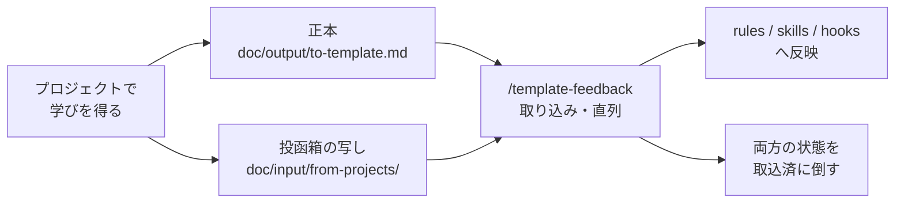

# ai-template

Claude Code 向けの開発プロンプトテンプレート。スキル（`/command`）・判断軸・安全装置で、人間とAIの協調開発を構造化します。

速さより **意図・存在設計・体験設計が宿ったソフトウェア** を作ることを目的にしています。AIに丸投げして速く終わらせるのではなく、判断基準を人間が握ったまま、AIに実装を任せられる状態を作ります。

参考: [Cole Medin氏 context-engineering-intro](https://github.com/coleam00/context-engineering-intro)

## 設計の考え方

| 原則 | 内容 |
|---|---|
| **判断軸は人間が握る** | AIは「何を考え、なぜそうするか」を言葉にしてから動く。判断基準をAI内部に隠さない |
| **レイヤーで積む** | 普遍ルール（`CLAUDE.md` / `rules`）の上に、プロジェクト固有の判断軸を重ねる（`judgment-harness`） |
| **関所を仕組みで置く** | 事前確認 → 実行 → 事後レビューの各段でフック・レビューエージェントが機械的に働く |
| **レビューは文脈遮断で** | 作った本人は自分の選択に錨づけされる。専任サブエージェントが差分だけを見て批評する |
| **学びを還流させる** | 各プロジェクトで得た汎用的な学びを送り状としてテンプレートへ戻す |

## 前提条件

| 必須/任意 | ツール | 用途 | 公式 |
|-----------|--------|------|------|
| **必須** | Claude Code | コア | [公式](https://www.anthropic.com/claude-code) |
| **必須** | GitHub CLI | task/bug管理 | [公式](https://cli.github.com/) |
| 任意 | Figma MCP | デザインSSOT取得 | [公式ガイド](https://help.figma.com/hc/en-us/articles/32132100833559-Guide-to-the-Figma-MCP-server) |
| 任意 | mise | ツール管理 | [公式](https://mise.jdx.dev/) |

## セットアップ

### 1. プロジェクトへ適用する

```bash
# dry-run で確認してから実行
scripts/apply_template.sh --target /abs/path/to/your-project --safe --dry-run
scripts/apply_template.sh --target /abs/path/to/your-project --safe
```

| オプション | 動作 |
|---|---|
| `--safe`（既定） | 既存ファイルを上書きしない |
| `--force` | テンプレート対象を上書き（削除はしない） |
| `--sync` | 上書き＋削除で同期。**危険** |
| `--no-skills` | `.claude/` をコピーしない（グローバル適用済みの場合） |
| `--overwrite-rdd` | `doc/input/rdd.md` を上書き（原則プロジェクト固有なので非推奨） |

配布されないもの: `doc/input/from-projects/`（テンプレート保守者の受信箱）、`doc/generated/reports/` の中身（ai-template 自身の作業記録）、`meta/`、`history/`。

### 2. グローバルへ適用する（任意）

```bash
scripts/apply_global.sh --dry-run      # 確認
scripts/apply_global.sh                # 判断軸スキルのみ
scripts/apply_global.sh --all-skills   # 手順系スキルも含む
```

適用対象: skills / hooks / rules / settings.json / CLAUDE.md

### 3. 安全装置が効いているか確認する

`main` への直接 commit / push はフックでブロックされます。**入れただけで安心せず、実際に動くか確かめてください**。

```bash
bash .claude/hooks/test-git-branch-guard.sh
```

一時リポジトリを自動生成し、「通すべき4ケース」「止めるべき6ケース」を実測します。`PASS=10 FAIL=0` になれば正常です。

> ガード系フックは、効いていないことが黙って起こります。「守られているつもり」は穴より危険なので、判定不能なら止める（fail-closed）設計にし、検証を同梱しています。

### 4. 技術スタック固有のスキルを足す（任意）

React / Svelte / Tailwind / GSAP / Three.js / Blender 等は **[ai-tech-knowledge](https://github.com/mae616/ai-tech-knowledge)** で管理しています。必要なものだけ追加してください。

## 使いはじめ

すべてのセッションは `/setup` で開始します（`/clear` → `/setup` が前提）。

| 状況 | 最初のコマンド |
|---|---|
| 新規プロジェクトを立ち上げる | `/project-init`（壁打ち → rdd.md → テンプレート適用 → CI確認） |
| 既存プロジェクトを把握する | `/repo-tour` → `/docs-reverse` |
| まず体験を探りたい | `/proto-loop` |
| 要件が固まっている | `/auto-build "作りたいものの説明"` |

## コマンド

### 自律ループ（Loop Engineering）

1コマンドでゴールまで自律実行する親スキル群。既存スキルを連鎖呼び出しし、人間の関所を最小限に絞っています（設計根拠: `meta/adr-lite.md` ADR-008/014/015）。

| コマンド | 入力 → ゴール | 人間の関所 |
|---------|--------------|-----------|
| `/auto-build "プロンプト文"` or `成果物パス` | 要件定義 → Sprint計画 → 全タスク自律実装 → エビデンスHTML提示 | rdd.md確認（プロンプト起点時）/ sprint→main マージ |
| `/auto-task #123` | 1タスクの実装 → テスト → レビュー収束 → task→sprint 自律マージ | 危険変更該当時のマージ判断 |
| `/auto-design <Figma URL/会話/SSOT>` | デザインSSOT → UI骨格 → 型付きコンポーネント → マージ | Vibe Coding（触って確認） |
| `/auto-bug #123` | bug調査 → 修正案の試行・効果検証 → マージ | 危険変更該当時のマージ判断 |

**共通の停止条件**: レビュー反復の上限超過 / bug連鎖3周で未解決 / 危険変更チェックリスト該当（`.claude/rules/code-quality.md`）/ 課金発生前。中断時は `history/loop-state.md` から再開できます。

### プロトタイプの連作ループ

`/auto-build` の前段。仕様を先に固めず、**1案ごとに「確かめたい問い」を人間と決めてから**作り、触った学びを設定集（Setting Book）へ蒸留して次の案に継ぎます。

| コマンド | 用途 |
|---|---|
| `/proto-loop` | 連作ループ本体。問いを立てる → 媒体を選ぶ → 作る → Vibe確認 → 設定集へ蒸留 → 反復 |
| `proto-medium`（自動適用） | 「Figma か、コードか」の判断軸。止まっている絵で判断できるなら Figma、動かさないと分からないならコード |

無指示で複数案を並べることはしません。比較軸が明確なラウンドでのみ2案を並行します。

### 手動フロー（1ステップずつ進めたい場合）

| 領域 | コマンド連鎖 |
|------|------------|
| タスク | `/task-list` → `/task-detail` → `/task-run` |
| バグ | `/bug-new` → `/bug-investigate` → `/bug-propose` → `/bug-fix` |
| デザイン | `/design-mock`（会話起点）or `/design-ssot`（Figma起点）→ `/design-ui` → `/design-components` → `/design-assemble`（任意: `/design-html`） |
| セッション | `/session-start` → 作業 → `/session-end` |

### レビュー（文脈遮断）

作った本人は自分の選択に錨づけされ、違和感を検出できません。レビューは専任サブエージェントが対象の参照だけを受け取って実行します。**文脈遮断であって情報遮断ではありません**（レビュアーは差分・rdd.md・設計書を自分で読みます。渡さないのは実装時の会話と意図の弁明です）。

| コマンド | 見るもの | 実行体 |
|---|---|---|
| `/basic-review` | typo・命名規約・フォーマット（表面） | `code-reviewer` |
| `/deep-review` | 設計整合性・セキュリティ・RDD準拠 | `code-reviewer` |
| `/design-critique` | レンダリング結果の違和感（デザイン版レビュー） | `design-critic` |
| `/pr-respond` | PRレビューコメントへの個別対応 | — |

### 判断軸・デザイン基盤

| コマンド | 用途 |
|---|---|
| `/judgment-harness` | 「何を良しとするか」をレイヤーで積み上げる方法論。プロジェクト立ち上げ時に最初に回す |
| `project-design-language`（雛形） | プロジェクト固有の存在設計・体験設計のSSOT。埋めて使う穴埋め雛形 |
| `/art-direction` | 描く瞬間の規律。コンセプト一語から材質・配色・タイポまでを1本の線で導出し、汎用ダッシュボード化を防ぐ |

### 補助

| コマンド | 用途 |
|---------|------|
| `/repo-tour` | リポジトリ構造の案内（初見向け） |
| `/pair plan\|design\|arch\|dev` | 壁打ち（短い反復で方針を固める） |
| `/build-context-site` | 要件・設計・ADR・図を横断する現状サイトを生成 |
| `/manual-gen` / `/manual-guide` | 手順書の生成と、ステップごとの案内 |
| `/docs-reverse` | コードベースから俯瞰ドキュメントを生成 |
| `/image-prep` | 生成AI画像を透過レイヤーへ加工（ImageMagick） |

### テンプレート保守（ai-template 側で使う）

| コマンド | 用途 |
|---|---|
| `/template-inbox` | このPCの投函箱を構築する。sibling を走査し、未取込の学びをローカルに materialize する |
| `/template-feedback` | 送り状を走査し、汎用化された学びをテンプレートへ取り込む。取り込み後は台帳を取込済に倒す |

## 学びの還流（送り状モデル）

各プロジェクトで得た汎用的な学びを、テンプレートへ戻す仕組みです。**プロジェクトはテンプレート本体を編集しません**。判断が1か所に集まるので、複数プロジェクトが並行しても競合しません。



- 送り状の書式は `doc/output/to-template.md`（各プロジェクトへ配布される雛形）
- 投函箱だけが `解決済みファイル`（直した実物のパス）を持ちます。取り込み時に**説明文ではなく動いている実物を読む**ためです
- 投函箱の中身は各PCローカル（Git追跡外）。受信データには出典マシンの絶対パスが載るため、公開・配布物に混ぜません。新しいマシンでは `/template-inbox` で組み直します
- 「状態」欄が二重取り込み防止の台帳として機能します

## 安全装置

### フック（`.claude/hooks/`）

| フック | タイミング | 役割 |
|---|---|---|
| `git-branch-guard.sh` | Bash実行前 | `main` / `master` への直接 commit・push をブロック。判定不能なら止める（fail-closed） |
| `warn-destructive-bash.sh` | Bash実行前 | 破壊的コマンドを警告 |
| `validate-mermaid.sh` | 編集後 | Mermaid構文を検証 |
| `format-on-edit.sh` | 編集後 | フォーマッタを適用 |
| `post-edit-notify.sh` | 編集後 | 編集通知 |
| `check-release-notes.sh` | セッション開始 | Claude Code のバージョン更新を検出 |
| `test-git-branch-guard.sh` | 手動 | ガードの通す/止める両方を実測（10ケース） |

### 運用ルール（`.claude/rules/` — 自動読み込み）

| ファイル | 内容 |
|---|---|
| `dev-practices.md` | 確認フロー（事前 → 実行 → 事後）、自律度の使い分け、デザインの発酵ループ |
| `code-quality.md` | 危険変更チェックリスト、スコープ外追加の三条件ガード、ADR-lite テンプレ |
| `tool-usage.md` | ツールエラー防止、ガード系フックの検証原則、外部連携の全層検証 |
| `context-management.md` | 毎ターン薄く効かせる文脈管理（意図の汲み取り / 問題の構造化 / 全体での位置付け） |
| `git.md` | ブランチ構造・命名規則・CI要件 |

### 危険変更チェックリスト

以下を含む変更は自律ループが停止し、人間に明示確認します。

認証・認可 / 決済 / 個人情報 / DBマイグレーション / 権限設定 / 外部API連携 / 削除処理 / 通知・メール送信

## Gitブランチ運用

```
main                    ← 直接 commit/push はフックでブロック
├── sprint/*            ← スプリント単位（CI通過後にmainへマージ）
│   ├── task/*          ← タスク単位（AI実装）
│   └── feature_fix/*   ← スプリント統合後のバグ修正
└── hotfix/*            ← 本番緊急修正
```

詳細は [.claude/rules/git.md](.claude/rules/git.md) を参照（Claude Codeが自動読み込み）。

## プロジェクト構成

```
ai-template/
├── .claude/
│   ├── skills/           # スキル（自律ループ / 手順系 / 判断軸）
│   ├── agents/           # 専任サブエージェント（code-reviewer / design-critic / design-drafter）
│   ├── hooks/            # フック（ブランチガード / Mermaid検証 等）
│   ├── rules/            # 運用ルール（自動適用）
│   └── settings.json     # 権限・hooks設定
├── doc/
│   ├── input/            # 【合意済み】SSOT。AIが前提として扱う（rdd.md / architecture.md / design/）
│   ├── draft/            # 【未合意】発酵中。AIは参考にするが前提にしない（設定集・検討中の案）
│   ├── generated/        # 【AI生成】上書きOK（manual/ / reverse/ / reports/）
│   └── output/           # 送り状（to-template.md）
├── scripts/
│   ├── apply_template.sh # プロジェクトへの適用
│   └── apply_global.sh   # ~/.claude への適用
├── meta/
│   ├── adr-lite.md       # 設計判断の記録
│   └── rdd.ai-template.md
├── CLAUDE.md             # AI判断基準（普遍ルール）
└── README.md
```

> **`input/` と `draft/` の違い**: プロトタイプが完走したことと、その中身が要件になることは別の話です。
> 作業の過程で生まれた判断は `draft/` に貯め、**人間の合意を経てから** `input/` へ上げます。
> AIは昇格候補を提示するだけで、上げるかどうかは判断しません（`doc/draft/README.md` / ADR-026）。

## 判断軸スキル（AIが状況に応じて自動適用）

`/command` として明示的に呼ばず、AIが文脈に応じて参照するスキル群です。

| カテゴリ | スキル |
|---------|--------|
| 事業 | `biz-researcher` / `persona-designer` / `proposition-reviewer` |
| デザイン | `ui-designer` / `usability-psychologist` / `sensory-design` / `animation-principles` |
| 開発 | `architecture-expert` / `developer-specialist` / `testing` / `security-expert` / `frontend-implementation` / `accessibility-engineer` / `keyboard-shortcuts` |
| クリエイティブ | `creative-coder` |
| 工程 | `experience-plan`（状態×見た目×周辺の網羅チェック） / `proto-medium`（Figma かコードか） / `project-design-language`（プロジェクト固有SSOT雛形） |
| ツール | `agent-browser` |
| 情報源 | `official-source-first`（制度・規約・料金は公式一次情報で判断。費用が出る手順の前に必ず適用） |

> 各スキルの詳細は `.claude/skills/*/SKILL.md` を参照

## 主な変更（v1.1.0 → v1.2.0）

| 領域 | 追加・変更 |
|---|---|
| 学びの還流 | 送り状モデルを仕組み化。投函箱（`doc/input/from-projects/`）をPCローカル化し、`/template-inbox` を新設 |
| 判断軸 | `judgment-harness`（レイヤー方法論）・`project-design-language`（プロジェクト固有SSOT雛形）を追加 |
| プロト工程 | `auto-mvp` を `/proto-loop`（連作ループ）へ置き換え。媒体判断ガイド `proto-medium` を新設 |
| レビュー | 文脈遮断レビューを水平展開。専任エージェント3種（`code-reviewer` / `design-critic` / `design-drafter`）を追加 |
| デザイン | `/art-direction`（描く瞬間の規律）・`/design-critique`（レンダリング批評ループ）を新設 |
| 可視化 | 概念・設計説明を Mermaid 図入り HTML アーティファクトで報告するルールと、レポート一覧の仕組みを追加 |
| 安全装置 | ブランチガードの3欠陥を修正し fail-closed 化。検証スクリプトを同梱 |
| 文脈管理 | `context-management.md` を常時ルールとして追加 |

設計判断の経緯は `meta/adr-lite.md` に ADR-lite として記録しています。

## ライセンス

[MIT License](LICENSE)

## コントリビューション

Feedback only OSS。[CONTRIBUTING.md](CONTRIBUTING.md) を参照。

## 参考

- [MCP Protocol](https://modelcontextprotocol.io/) / [Figma MCPカタログ](https://www.figma.com/ja-jp/mcp-catalog/)
- [Claude Code](https://www.anthropic.com/claude-code) / [mise](https://mise.jdx.dev/)
